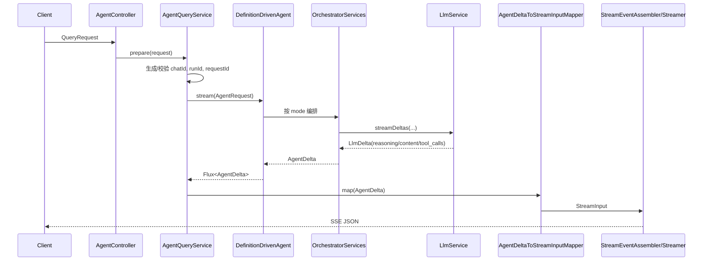
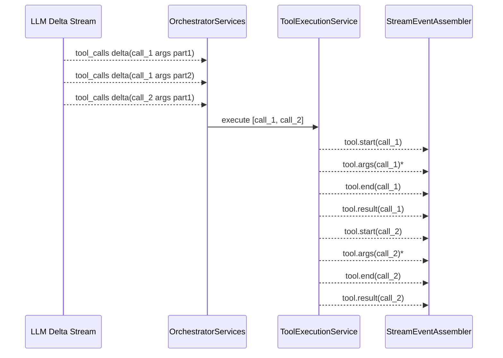
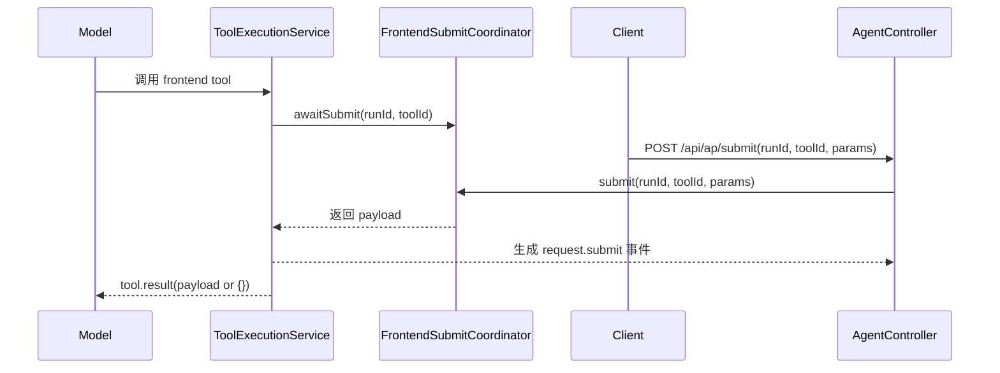

# 核心数据流

## 1. Query 真流式链路（`POST /api/ap/query`）


关键事实：
- `runId` 由 `RunIdGenerator.nextRunId()` 生成（base36 epoch millis）。
- `requestId` 默认等于 `runId`。
- `chat.start` 仅首次 chat 发射。
- 上游每个 delta 到达后立即向下游发射，不做整段缓存拆分。

## 2. 多工具调用（单轮多 `tool_call_id`）


关键事实：
- 同一模型回合允许出现多个 `tool_call_id`。
- 每个 `tool_call_id` 独立维护 start/args/end/result 边界。
- `tool.args` 支持多片段（`chunkIndex` 递增）。
- 若在 `tool.result` 到达时 `tool.end` 尚未发出，assembler 会先补发 `tool.end` 再发 `tool.result`。

## 3. Frontend tool 回填链路（`POST /api/ap/submit`）


关键事实：
- submit 超时由 `agent.tools.frontend.submit-timeout-ms` 控制（默认 300000ms）。
- unmatched submit 不报 HTTP 错误，返回 `accepted=false,status=unmatched`。
- `/submit` 的事件主名是 `request.submit`，语义为“tool 参数回填”。

## 4. Action 与 Tool 参数流边界语义

Action 序列：
- `action.start`
- `action.args`（可多次）
- `action.end`
- `action.result`

Tool 序列：
- `tool.start`
- `tool.args`（可多次）
- `tool.end`
- `tool.result`

边界约束：
- `action.end` / `tool.end` 均表示该调用参数流（`*.args`）的完整结束。
- 结果事件（`*.result`）发生在参数流结束之后。

## 5. Chat 历史回放链路（`GET /api/ap/chat`）
```mermaid
flowchart LR
    ChatAPI[GET /api/ap/chat] --> Store[ChatRecordStore.loadChat]
    Store --> DB[(CHATS sqlite)]
    Store --> File[(chats/{chatId}.json)]
    File --> Parse[解析 query/step/event 行]
    Parse --> Snapshot[构建 events + rawMessages]
    Snapshot --> Resp[ChatDetailResponse]
```

关键事实：
- `includeRawMessages=false` 不返回 `rawMessages`。
- `events` 永远返回。
- 历史以 snapshot 粒度回放（`reasoning/content/tool/action.snapshot`），并保留 `tool.result` / `action.result` / `run.complete`。
- `request.submit` 事件会被持久化并参与历史回放。

## 6. Data 文件授权链路（`GET /api/ap/data`）
```mermaid
flowchart LR
    Req[/api/ap/data?file=...&t=...] --> Normalize[DataFilePathNormalizer]
    Normalize --> Token{data-token-validation-enabled 且有 t?}
    Token -->|是| Verify[ChatImageTokenService.verify]
    Verify --> Scope{scope=ap_data:read?}
    Scope --> Access[ChatAssetAccessService.canRead(chatId,file)]
    Token -->|否| FileCheck[文件存在与路径约束]
    Access --> FileCheck
    FileCheck --> Resp[inline/attachment 响应]
```

关键事实：
- token 分支失败返回 `403`，`data.errorCode` 给出具体 token 错误码。
- 路径逃逸或非法参数返回 `400`。
