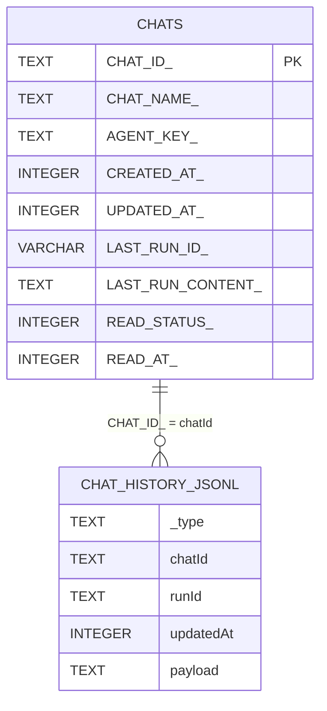

# 数据库与存储设计

## 总览
本项目不使用传统业务库表建模，核心存储由两部分组成：
1. SQLite 索引（会话摘要）
2. JSONL 文件（逐 run 增量记忆与历史）

## SQLite（`CHATS`）
初始化 SQL（`ChatRecordStore`）：

| 列名 | 类型 | 约束 | 说明 |
|---|---|---|---|
| `CHAT_ID_` | TEXT | PK | chat UUID |
| `CHAT_NAME_` | TEXT | NOT NULL | 会话名 |
| `AGENT_KEY_` | TEXT | NOT NULL | 绑定 agent |
| `CREATED_AT_` | INTEGER | NOT NULL | 毫秒时间戳 |
| `UPDATED_AT_` | INTEGER | NOT NULL | 毫秒时间戳 |
| `LAST_RUN_ID_` | VARCHAR(12) | NOT NULL | 最新 runId |
| `LAST_RUN_CONTENT_` | TEXT | NOT NULL | 最新回复摘要 |
| `READ_STATUS_` | INTEGER | NOT NULL | 0 未读 / 1 已读 |
| `READ_AT_` | INTEGER | NULL | 已读时间 |

索引：
- `IDX_CHATS_LAST_RUN_ID_ (LAST_RUN_ID_)`

## JSONL（`chats/{chatId}.json`）
一行一个对象，类型由 `_type` 区分：
- `query`: 用户请求快照
- `step`: 执行步骤快照
- `event`: 持久化事件快照（筛选后）

### `query` 行核心字段
- `chatId`, `runId`, `updatedAt`, `query`

### `step` 行核心字段
- `chatId`, `runId`, `_stage`, `_seq`, `updatedAt`
- 可选：`taskId`, `system`, `plan`, `messages`

### `messages`（OpenAI 风格）
- user: `content[]`
- assistant: `content[]` / `reasoning_content[]` / `tool_calls[]`
- tool: `name`, `tool_call_id`, `content[]`

### ID 约定
- reasoningId: `r_xxxxxxxx`（或流式块 ID）
- contentId: `c_xxxxxxxx`
- frontend toolId: `t_xxxxxxxx`
- actionId: `a_xxxxxxxx`
- msgId: `m_xxxxxxxx`

## 存储关系图（Mermaid）

## 读写策略
- 写入：运行中增量 append（低耦合，便于回放）。
- 读取：按 run 聚合并重建 snapshot events。
- 裁剪：`memory.chat.k` 按 run 维度保留最近 K 组。
