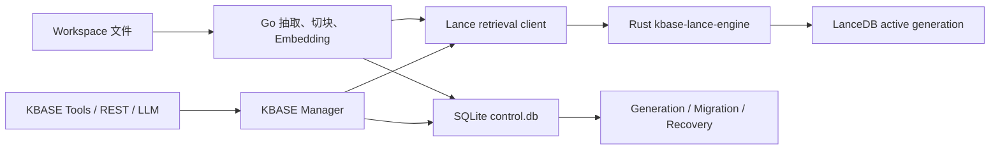

# KBASE LanceDB 迁移

## 定位与当前状态

KBASE 的新检索主路径是本地 LanceDB，但 Go runtime 仍保持 `CGO_ENABLED=0`。运行时不直接链接 `lancedb-go`，而是启动随安装包分发的 `kbase-lance-engine` Rust 伴随进程。Rust 工程固定 `lancedb = "=0.30.0"` 并提交 `Cargo.lock`。

SQLite 没有被完全移除：

- schema v2 `kbase.db` 保留为迁移前服务与紧急回滚 retrieval adapter。
- schema v3 `control.db` 是持久控制面，记录 generation、文件快照、迁移、跨库文件操作和 refresh run。
- LanceDB generation 保存 chunks、`float32` embedding、FTS、scalar index 和可选 ANN index。

迁移保持现有五个 KBASE tools、REST 路径、JSON DTO、chunk ID、`source.publish` 与 chat replay 契约。RRF 是有意的检索行为升级，score 不要求与旧线性融合数值相等。

## 架构



Go 继续负责 workspace 扫描、include/exclude、PDF/DOCX/PPTX/HTML/文本抽取、稳定 chunk ID、embedding provider、watcher/reconcile/refresh、对外 tool/API 和 `source.publish`。sidecar 负责 Lance table handle、Arrow IPC 批量写入、整文件 replace/delete、FTS/scalar/vector 索引、vector/FTS/hybrid 检索、read、validate、stats 与 optimize。

`internal/agent/kbase` 中的 `MetadataStore` 和 `RetrievalStore` 是两个边界：前者由 `ControlStore` 实现，后者由 `SQLiteRetrievalStore` 和 `LanceRetrievalStore` 实现。抽取/切块管线通过更窄的 workspace index store 契约共用，因此切换存储不改变 chunk 生成逻辑。

## 存储布局

每个 KBASE agent 拥有独立 canonical storageDir。启动前会校验 owner，两个 agent 指向同一 storageDir 会失败并列出 agent keys。

```text
<storageDir>/
  kbase.db
  manifest.json
  control.db
  migrations/
    <migrationId>.snapshot.db
  generations/
    <generationId>/
      manifest.json
      lance/
        chunks.lance/
      validation.json
```

- `kbase.db` 和 `manifest.json` 属于 schema v2 legacy 路径。Lance 激活后它们不再被长期 dual write，也不自动删除。
- `control.db` 使用 schema version `3`，包含 `KBASE_META`、`KBASE_FILES`、`KBASE_GENERATIONS`、`KBASE_MIGRATIONS`、`KBASE_FILE_OPS` 和 `KBASE_INDEX_RUNS`。`KBASE_FILES` 以 `(GENERATION_ID_, PATH_)` 为主键。
- `snapshot.db` 使用 modernc SQLite online backup API 生成，包含已提交 WAL 内容；成功激活后删除，失败时保留以便恢复/审计。
- active generation ID 保存在 `control.db`。切换不依赖目录 rename 或覆盖，旧 active generation 在同一 SQLite transaction 中转为 retired。

Lance chunks table 保存 `chunk_id/file_id/path/ext/ordinal/heading`、行/页/slide 定位、`source_type/locator_json/content/fts_text/content_hash`、embedding model/dimension、`FixedSizeList<Float32>` vector 和 `updated_at`。一个 generation 只允许一个 vector dimension，dimension 改变必须新建 generation。

## Engine 配置与切流

`configs/kbase-settings.yml -> storage.engine` 支持：

| 模式 | 行为 |
|---|---|
| `auto` | 无 verified active Lance generation 时使用 SQLite；refresh 先更新 legacy，再尝试迁移。迁移/sidecar 失败不切流。 |
| `lancedb` | 必须使用 LanceDB。无 active generation 或 sidecar 不可用时返回 KBASE unavailable。 |
| `sqlite` | 使用 legacy SQLite retrieval。Lance 激活后切回时先标记 stale/indexing 并执行 workspace refresh，不返回冻结旧索引。 |

`auto` 只在 generation 完成建索引、完整性验证和检索校验后才原子激活。构建期间的查询仍使用旧 active generation 或 legacy SQLite，不存在先清库后导入的空窗。

`indexHash` 包含 schema、workspace/storage、embedding model/dimension、chunk、include/exclude、extraction 和 FTS tokenizer。`queryHash` 只包含 topK、fusion、RRF K、weights 和 candidate 参数。只有 `indexHash` 变化或 `force=true` 才构建新 generation；调整检索权重不再引发全量重建。

## Sidecar 生命周期和私有协议

runtime 内所有 KBASE agent 共用一个 sidecar。它在存在 KBASE agent 的 startup refresh 或第一次 Lance 请求时懒启动；非 KBASE 模块不依赖它成功启动。

安全与健康约定：

- 只允许 `127.0.0.1:0` loopback 监听。
- Go 每次启动生成 32-byte 随机 token，通过子进程环境传入，每个请求都校验 Bearer token。
- stdout 首行必须是 `protocolVersion/engineVersion/lancedbVersion/listenAddress` handshake；stderr 作为 `[kbase-lance]` 运行日志。
- handshake 10 秒超时，health 2 秒超时。失败时按 1、2、4 秒退避重试，最终为 `engine_unavailable`语义。
- Go 传入 parent PID，sidecar watchdog 在父进程消失后自动退出。正常关闭先调用 `/v1/shutdown`，等待 5 秒后强制终止。

私有接口包含 health、generation create/release/import/validate、index build、replace/delete file、search、read chunk/path、stats、optimize 和 shutdown。控制/搜索/读取使用 JSON，bulk import 与非空 replace 使用 Arrow IPC stream。这些端点不是公开 API，不对浏览器、sandbox 或网关暴露。

sidecar 使用稳定错误码：`invalid_request`、`generation_not_found`、`schema_mismatch`、`dimension_mismatch`、`index_not_ready`、`query_invalid`、`storage_busy`、`storage_corrupt`、`engine_internal`。Go 转换为现有 KBASE HTTP/tool 错误语义，不对外返回 Rust 堆栈。

## 索引与检索

### FTS 和 scalar index

`fts_text` 由 path、heading 和 content 组成。默认 `base-tokenizer: icu` 由 sidecar 使用 ICU4X word segmenter 对中英混合文本预分词，再使用 Lance whitespace FTS tokenizer，不需要额外 Jieba 模型。FTS 参数为 lower case、不 stem、不移除 stop words、ASCII folding、不存 position。

scalar index 为：

- `chunk_id`、`file_id`、`path`：BTREE。
- `ext`：BITMAP。

用户 query 作为 terms query，不直接拼接 `AND/OR` 表达式。Lance FTS parser 拒绝查询时，sidecar 退回受 candidateK 限制的 escaped substring scan；存储/索引错误则不静默降级。

### Vector index

- chunk 数小于 `ann-min-rows` 时不创建 ANN，使用 cosine flat search。默认门槛为 50,000。
- 达到门槛时创建 cosine `IVF_HNSW_SQ`，跨全表确定性均匀抽取最多 32 个 vector，将 ANN 结果与 bypass-index flat ground truth 比较。校验与正式查询共用 `nprobes=32`、按候选数动态扩大的 HNSW `ef` 和三倍原向量重排策略；这些是 sidecar 内部质量参数，v1 不对 agent 配置暴露。recall@10 低于 0.95 时立即删除 ANN 索引并继续 flat。

### 加权 RRF

查询向量由 Go 通过 active generation 持久化的 embedding model snapshot 生成，而不是盲目采用正在构建的新 agent 配置；blue-green 构建和 generation rollback 因此不会混用向量空间。验证 dimension/NaN/Inf 后转为 `float32`。vector 和 FTS 在 sidecar 中并行取候选，pathPrefix/pathGlob/type 尽可能下推；pathGlob 保持 Go 旧路径的完全锚定语义，`*`/`?` 不跨目录，`**/` 可跨目录。

```text
requested = offset + limit
candidateK = min(candidateMax,
                 max(candidateFloor, candidateMultiplier * requested))
```

默认为 `candidateFloor=30`、`candidateMultiplier=4`、`candidateMax=500`。两个权重先归一化，然后：

```text
rawScore = vectorWeight / (rrfK + vectorRank)
         + ftsWeight    / (rrfK + ftsRank)

score = clamp(rawScore / (1 / (rrfK + 1)), 0, 1)
```

未进入某路候选的项为 0。只命中某一路标记 `vector` 或 `fts`，两路命中标记 `hybrid`。最终按 score 降序、path 升序、startLine 升序、chunk ID 升序，保证结果稳定。

`count` 是当页实际数，`matchCount` 是两路受限候选的去重 union。任一路达到 `candidateMax` 或 offset/limit 后仍有融合结果时 `truncated=true`。

## Incremental refresh 和崩溃恢复

文件新增/变化的正常路径：

1. Go 抽取、切块并生成 embedding。
2. `KBASE_FILE_OPS` 写入 `prepared`。
3. sidecar 在 Lance write lock/transaction 中按 `chunk_id` merge-insert，然后删除同 file ID 中不再存在的 chunk。
4. sidecar 返回 table version，control 操作转为 `lance_committed`。
5. 同一 SQLite transaction 更新 generation 文件快照，并将同 path 的 pending operation 置为 `completed`。

skipped/error/源文件删除共用 delete 路径。搜索不会看到“先删后插”的空文件，重放 replace/delete 是幂等的。

启动/下次 refresh 会扫描未完成 operation。operation 同时保存目标文件记录与逐文件 chunk/content/path/locator digest；如果 Lance 当前 table version 和 digest 已证明目标写入可见，即使 journal 仍停在 `prepared` 或 `lance_committed`，也可直接补交 control.db transaction，不重新调用 embedding provider。无法证明已提交时才把文件标记为必须重访并幂等重放 replace/delete。恢复失败达三次后该文件标记 error，不阻断其他文件或旧 active generation 查询。status 通过 `pendingRecoveryOperations` 暴露剩余操作数。

满足任一条件时 optimize：当前 generation 变更计数达到默认 1000，距上次 optimize 超过默认 24h、ANN unindexed rows 超过总量 10%，或新 generation/force rebuild 需要强制 optimize。sidecar 执行 fragment compaction、index optimize 和按默认 168h 保留期 prune Lance versions。

## Legacy 迁移状态机

实现使用以下主路径：

```text
snapshotting -> importing -> indexing -> validating
             -> shadowing -> ready -> active
```

错误会记录为 `failed_retryable`；数据不可直接导入时记录 `legacy_requires_rebuild`，`auto` 尝试在新 generation 中 cold rebuild。契约也保留 `failed_permanent/cancelled`状态，但当前常规失败路径使用 retryable。

直接导入步骤：

1. 在 storage lock 内用 SQLite online backup API 创建一致性 `snapshot.db`。
2. 校验 legacy embedding model/dimension，创建 migration 与 building generation。
3. 复制文件快照，按 512 chunks 一批流式读取：校验 chunk ID 唯一、BLOB/dimension、NaN/Inf 和 content hash，将 `float64` 转为 `float32`，用 Arrow IPC 导入。
4. 导入阶段不调用 embedding provider；只有快照建立后 workspace 新增/变化的文件在 catch-up refresh 中需要新 embedding。
5. 比对 chunk/file ID-set digest 和计数，然后建立 FTS/scalar/可选 vector index。
6. 扫描 workspace 补齐迁移期变化，执行 generation 完整性验证与检索校验。
7. 验证通过后原子激活，写入 `activeGeneration/indexHash/queryHash`，删除临时 snapshot，保留 `kbase.db`。

迁移在 snapshot/import 阶段中断时可从保留的 snapshot 和 generation 重试，并重放幂等 batch。workspace reconcile 开始后 generation 可能合法地包含 snapshot 之外的新行；若此后中断，下一次重试会使用新 generation，避免把 upsert-only snapshot 重放进已变化的表而永久卡在 digest 门槛。以下情况会转 cold rebuild：embedding model/dimension 不匹配、vector BLOB/行 schema 无法解析、NaN/Inf、重复 chunk ID 或 content hash 不一致。cold rebuild 失败不切换 active engine。

### 验证门槛

generation 完整性校验要求：chunk/file 计数与 ID-set digest 一致；逐文件 chunk ID、content hash、path、heading、行/页/slide 与 locator digest 完全一致；无重复 chunk ID；vector dimension 正确且无 NaN/Inf；FTS/scalar/vector 索引 ready。generation 状态切换和 `activeGeneration/indexHash/queryHash/embedding snapshot` 元数据在同一 control.db transaction 中提交。

检索校验从 legacy chunk 的 heading、文件名和内容前缀构造最多 `max-replay-queries` 条确定性查询，复用旧 chunk vector，不调用 provider。门槛为：

- legacy 非空查询的 Lance 结果不得为空。
- 平均 overlap@8 不低于 0.70。
- legacy top1 进入 Lance top8 的比例不低于 0.95。
- retrieval-only p95：不超过 10k chunks 的 generation 不高于 200ms，更大 generation 不高于 500ms。
- 使用 ANN 时 recall@10 不低于 0.95，否则保持 flat。

校验报告写入 `generations/<id>/validation.json`。门槛未通过不自动降低要求，generation 标记 failed，`auto` 继续 SQLite。切换后还会按 query SHA-256 确定性抽样 `shadow-live-percent` 的实时查询，异步与 legacy 结果比较；影子查询不增加用户请求延迟，不写正式 `source.publish`。

## 回滚与保留策略

- Lance generation 回滚：KBASE Manager 提供内部 `RollbackGeneration` 能力，先重新注册/验证 ready/retired generation，再在 `control.db` 中原子激活，不移动或复制 Lance 目录。当前没有公开 generation rollback REST 路由。
- SQLite 紧急回滚：设置 `storage.engine: sqlite` 并重启。`control.db` 的 `legacyNeedsRefresh` 使 legacy search/read/files 在 refresh 前不返回冻结数据；search 同时返回 stale/indexing，后台 refresh 完成后恢复读取。
- 保留：当前代码不自动删除 `kbase.db` 或 orphan storage。`migration.retain-legacy` 已进入配置契约，但 `false` 不是清理指令。generation/version 数据只在明确 maintenance/optimize 中裁剪。

## Status 与运维

`GET /api/kbase/{agentKey}/status` 保留所有旧字段，可增加：

- `engine`、`schemaVersion`、`generation`。
- `migration` 进度/错误。
- `indexes.fts/vector`、`lastOptimizedAt`。
- `sidecar.available/protocolVersion/engineVersion/lancedbVersion/lastError`。
- `legacyAvailable`、`pendingRecoveryOperations`、`storageDiskUsage`。

同一组可选字段也会进入 `kbase_status` 的 structured result。`KBASE_INDEX_RUNS` 额外记录 generation、engine、迁移 chunk 数、建索引时长和验证时长。

sidecar 日志统一用 `[kbase-lance]`。不记录原始文档、embedding 数值或完整 query；影子检索只记 query 字符长度和 SHA-256 前缀。

Manager 在启动和 catalog reload 时维护 watcher：agent 删除或 workspace 变更会停止旧 watcher、释放 active Lance handle 并绑定新路径。runtime KBASE 根目录下无当前 agent owner 的子目录会做只读审计，日志列出 path、sizeBytes、lastUsedAt 和可能 owner，不自动删除。

## 打包、直接下载与外部验证边界

release bundle 将当前平台的 `kbase-lance-engine[.exe]` 放入 `bin/`，不包含全平台 native archive，用户不需要本地 Rust toolchain。`scripts/release-assets/builtins.lock.json` 记录 sidecar 1.0.0、LanceDB SDK 0.30.0、license 与 build target hook；仓库不伪造尚未发布的平台 URL/SHA。

无需安装 GitHub 插件，可用已编译 artifact 直接下载 staging：

```bash
KBASE_LANCE_ENGINE_URL="https://artifacts.example/kbase-lance-engine" \
KBASE_LANCE_ENGINE_SHA256="<64位 SHA-256>" \
scripts/stage-kbase-lance-engine.sh \
  --output release-local \
  --os darwin \
  --arch arm64
```

PowerShell 的 `scripts/stage-kbase-lance-engine.ps1` 支持同等参数。下载没有 expected SHA-256 会拒绝，digest 不匹配会删除临时 `.download` 文件并失败。本地 `make run` 可将 sidecar 作为 optional artifact，便于非 KBASE/SQLite 开发；正式 `release-program` 会自行构建当前主机 sidecar，并强制 artifact、checksum、Cargo dependency metadata、sidecar CycloneDX SBOM、bundle CycloneDX SBOM 和 license metadata，缺少 Syft 或元数据即失败。显式非本机矩阵由 Platform release 的目标专属 URL/SHA 配置下载，不需要 Desktop 预置 artifact。

Git 忽略规则覆盖任意 Rust `target/`、release staging、默认 runtime/run 目录和 workspace 本地 `.kbase/`；`Cargo.lock`、Rust 源码、构建/下载脚本、配置 example 与许可证清单属于发布事实，必须提交。

build/stage 脚本已覆盖 darwin/linux/windows 的 amd64/arm64 target 入口，Docker 已改为 Debian bookworm slim/glibc 并以非 root 运行主程序与 sidecar。容器 `HEALTHCHECK` 调用主程序的 `healthcheck` 子命令访问免鉴权 `/healthz`；该端点确认 Go HTTP runtime 可达，并在存在非 SQLite KBASE agent 时由 Go 使用私有 Bearer token 完成 sidecar protocol-v1 health handshake。但“有构建 hook”不等于“六平台已验证”；实际 artifact 发布、macOS codesign/notarization、Windows signing、SBOM 产出与六平台 build/start/search smoke 必须在 release CI/对应真实 runner 完成后才能标记通过。

## 非目标和宣传边界

当前 KBASE 仍是文本型知识库：

- PDF、DOCX、PPTX 和 HTML 先抽取文本，再切块/embedding。
- 没有 OCR、ASR、OpenCLIP、ImageBind、ColPali 或视频关键帧管线。
- 没有图片、音频或视频语义检索，也不把原始大文件写入 LanceDB。
- chat、memory、automation 和其他 SQLite 数据不在本次迁移范围。

因此文档、状态和对外说明只能宣称“本地文本 KBASE 的 LanceDB 检索与 SQLite 迁移”，不得宣称已实现多模态理解。
